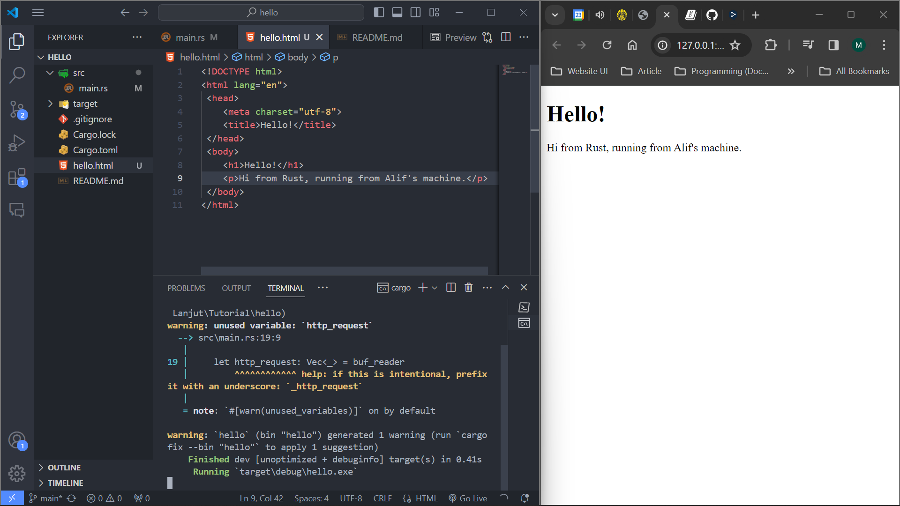
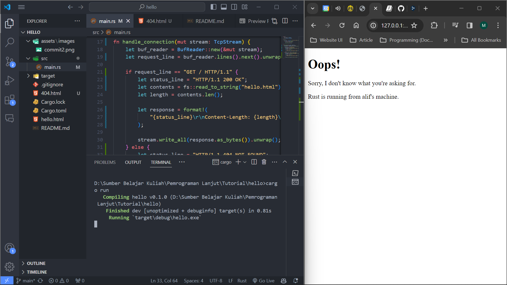

Nama : M.Alif Al Hakim \
Kelas : B \
NPM : 2206081250

# Refleksi

### Commit 1 Reflection Notes

`handle_connection` berguna untuk membaca *request* dari browser saat sudah terkoneksi dengan server. Di dalam fungsi `handle_connection`, dibuat sebuah *instance* `BuffReader` yang membungkus *mutable reference* ke `stream` yang mana merupakan *instance* `TcpStream` yang diterima dari browser. `BuffReader` kemudian bertugas untuk membaca `stream` yang diterima. `BuffReader` akan membaca *request* yang dikirimkan browser dan melakukan *splitting* setiap bertemu dengan karakter *new line* sehingga `BuffReader` akan membaca *request* secara per-baris. Hasil bacaan per-baris tersebut kemudian disimpan pada variabel `http_request` yang merupakan sebuah *instance* *vector*. Terakhir, fungsi `handle_connection` akan mem-*print* isi dari vector `http_request` tersebut.

### Commit 2 Reflection Notes

Pada fungsi `handle_connection` yang baru, kita tidak hanya membaca *request* dari browser, tetapi juga mengembalikan HTTP response ke *client* atau *browser*. HTTP response yang dikirimkan terdiri dari 3 bagian yaitu *status line*, *header*, dan *message body*. *Status line* berisi *HTTP Version, Status Code*, dan *Reason pharse*. Pada fungsi `handle_connection`, *status line* direpresentasikan oleh variable `status_line`. Sementara itu, *header* yang dikirimkan berupa informasi *content length*. Untuk *message body* dikirimkan sebuah html sederhana. Html tersebut akan dibaca dan di-*convert* menjadi string menggunakan *library* `fs`. Ketiga komponen tersebut kemudian digabungkan pada variable `response` dan dikirimkan pada instance `stream` sebelumnya.



### Commit 3 Reflection Notes

Pada modifikasi kali ini, fungsi `handle_connection` diberi fungsi untuk memvalidasi *request* yang diterima dan memberikan response yang sesuai. Validasi dilakukan dengan mengecek *path* yang di-*request* oleh browser. Fungsi `handle_connection` akan mengembalikan `hello.html` jika *path* yang di-*request* adalah *path* `/`. Sementara untuk *request* menuju *path* lain, fungsi `handle_connection` akan mengembalikan response menggunakan `404.html` sebagai *message-body* nya. Path yang diminta oleh browser tersebut dapat diambil melalui baris pertama dari HTTP request. Pada fungsi `handle_connection`, variabel `request_line` hanya akan mengambil baris pertama dari HTTP request yang kemudian akan diperiksa *path* yang diminta.

Selain itu, saya juga melakukan *refactoring* dimana kode awalnya adalah sebagai berikut.
```rust
fn handle_connection(mut stream: TcpStream) {
    let buf_reader = BufReader::new(&mut stream);
    let request_line = buf_reader.lines().next().unwrap().unwrap();

    if request_line == "GET / HTTP/1.1" {
        let status_line = "HTTP/1.1 200 OK";
        let contents = fs::read_to_string("hello.html").unwrap();
        let length = contents.len();

        let response = format!(
            "{status_line}\r\nContent-Length: {length}\r\n\r\n{contents}"
        );

        stream.write_all(response.as_bytes()).unwrap();
    } else {
        let status_line = "HTTP/1.1 404 NOT FOUND";
        let contents = fs::read_to_string("404.html").unwrap();
        let length = contents.len();

        let response = format!(
            "{status_line}\r\nContent-Length: {length}\r\n\r\n{contents}"
        );

        stream.write_all(response.as_bytes()).unwrap();
    }
}
```

Berikut adalah kode setelah *refactoring*.
```rust
fn handle_connection(mut stream: TcpStream) {
    let buf_reader = BufReader::new(&mut stream);
    let request_line = buf_reader.lines().next().unwrap().unwrap();

    let (status_line, filename) = if request_line == "GET / HTTP/1.1" {
        ("HTTP/1.1 200 OK", "hello.html")
    } else {
        ("HTTP/1.1 404 NOT FOUND", "404.html")
    };

    let contents = fs::read_to_string(filename).unwrap();
    let length = contents.len();

    let response =
        format!("{status_line}\r\nContent-Length: {length}\r\n\r\n{contents}");

    stream.write_all(response.as_bytes()).unwrap();
}
```

*Refactoring* ini bertujuan untuk mengurangi adanya duplikasi code yang ada pada if-else. *Refactoring* ini membantu kita memahami kode dengan lebih mudah. Selain itu, *refactoring* ini juga memudahkan kita dalam melakukan modifikasi jika kita ingin mengubah bagaimana proses *reading* dan *response writing* bekerja.



### Commit 4 Reflection Notes

Pada modifikasi kali ini, fungsi `handle_connection` akan menangani tiga kemungkinan *request* path, yaitu `/sleep`,`/`,dan *path* selain itu. Untuk *request* dengan path `/sleep`, server akan *sleep* selama 10 detik terlebih dahulu sebelum me-*render* `hello.html`.  Sementara untuk dua *request* lainnya masih sama dengan fungsi sebelumnya. Jika kita mengakses path `/`, lalu mengakses path `/sleep` maka browser akan menerima respons path `/` dengan cepat dan respon path `/sleep` 10 detik setelah diakses. Sementara itu, jika kita mengakses path `/sleep` terlebih dahulu lalu mengakses path `/`, maka respons dari path `/` juga akan tertunda selama kira-kira 10 detik. Hal ini dikarenakan server kita masih meng-*handle* permintaan secara satu persatu sehingga jika suatu *request* lambat untuk direspon, maka permintaan lain setelahnya juga akan mengalami penundaan. 

### Commit 5 Reflection Notes

*Thread pool* adalah kumpulan *spawned thread* yang menunggu dan siap untuk mengerjakan suatu *task*. Ketika program menerima sebuah *task* baru, program akan menugaskan salah satu *thread* pada *thread pool* untuk mengerjakan *task* tersebut. Sementara itu, *spawned thread* lain akan bersiap untuk melakukan *task* lain yang datang ketika *thread* pertama masih melakukan *task*-nya. Ketika *thread* pertama tadi telah selesai melaksanankan *task*-nya, maka ia akan kembali ke *thread pool* dan bersiap untuk melakukan *task* lain yang akan datang. *Thread pool* ini dapat membantu program memproses *request* secara bersamaan sehingga *throughput* server dapat meningkat. Pada *thread pool*, kita membatasi jumlah *thread* pada *pool* menjadi bilangan yang kecil untuk mencegah *Denial of Service* (DoS) *attacks*.